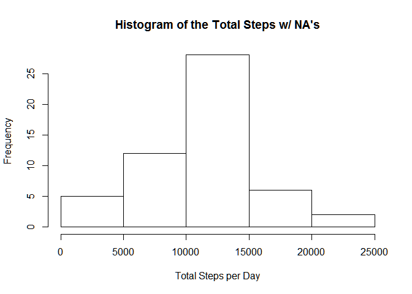
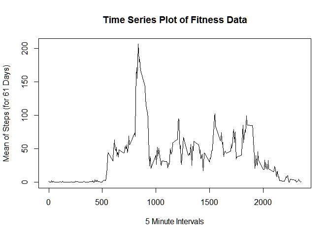
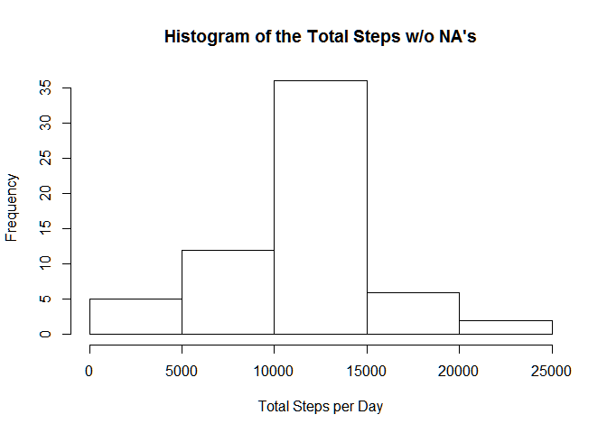
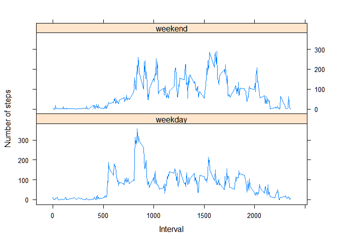

# Reproducible Research: Peer Assessment 1
###Overview:
This report follows the order and general format contained in the Assignment Instruction.  It is based on a dataset from a personal activity monitoring device. This device collects data at 5 minute intervals through out the day. The data consists of two months of data from an anonymous individual collected during the months of October and November, 2012 and include the number of steps taken in 5 minute intervals each day.

The original dataset is assigned to a varible "df1".  Subsequent modifications are assigned to varible of the format dfx (with x indicating the consecutive revison number).  The "dplyr" library is used in the R code that follows.

###Loading and preprocessing the data
Set the work directory on your local computer with setwd("your working directory path here") then adjust the path in the read.csv function as needed to locate the "activity.csv" file.

```r
library(dplyr)
df1 <- read.csv("activity/activity.csv") 
```

### What is mean total number of steps taken per day?


```r
df2 <-
  df1 %>%
  group_by(date) %>%
  filter(!steps == "NA", !steps == 0) %>%
  summarise(Total = sum(steps))

hist(df2$Total, main = "Histogram of the Total Steps w/ NA's", xlab = "Total Steps per Day")
```

 


```r
df3 <-
  df1 %>%
  group_by(date) %>%
  filter(!steps == "NA", !steps == 0) 
print (paste("Mean of Total Steps =",round(mean(df3$steps),1)))
```

```
## [1] "Mean of Total Steps = 134.3"
```

```r
print (paste("Median of Total Steps =",round(median(df3$steps),1)))
```

```
## [1] "Median of Total Steps = 56"
```


### What is the average daily activity pattern?


```r
df4 <-
  df1 %>%
  group_by(interval) %>%
  filter(!steps == "NA") %>%
  summarise(Mean = mean(steps))

plot(df4$interval, df4$Mean, type = "l", main = "Time Series Plot of Fitness Data", xlab ="5 Minute Intervals", ylab = "Mean of Steps (for 61 Days)")
```

 

```r
Max <- df4[which.max(df4$Mean),1]
print (paste("Time Interval with max steps on average is ", Max))
```

```
## [1] "Time Interval with max steps on average is  835"
```
### Imputing missing values

####&nbsp;&nbsp;&nbsp;&nbsp;&nbsp;&nbsp; 1. Number of rows with "NA"

```r
print (paste("Total rows containing NA = ", sum(is.na(df1$steps))))  
```

```
## [1] "Total rows containing NA =  2304"
```
####&nbsp;&nbsp;&nbsp;&nbsp;&nbsp;&nbsp; 2. & 3.  Fill in NA with mean for that day; create new dataset
      

```r
df5 <- df1
for (i in 1:nrow(df5))
  {
  if (is.na(df5[i,1]))
    {
    interval <- df5[i,3]
    for (j in 1:nrow(df4))
      {
      if (interval == df4[j,1])
        {
        value <- df4[j,2]
        df5[i,1] <- value
        }
      }
    }
  }
```

####&nbsp;&nbsp;&nbsp;&nbsp;&nbsp;&nbsp; 4a. Make histogram of new dataset

```r
df6 <-
  df5 %>%
  group_by(date) %>%
  filter(!steps == "NA",!steps == 0) %>%
  summarise(Total = sum(steps))

hist(df6$Total, main = "Histogram of the Total Steps w/o NA's", xlab = "Total Steps per Day")
```

 

####&nbsp;&nbsp;&nbsp;&nbsp;&nbsp;&nbsp; 4b. Report mean & med1an of new dataset


```r
df7 <-
  df5 %>%
  group_by(date) %>%
  filter(!steps == "NA", !steps == 0) 
print (paste("Mean of Total Steps =",round(mean(df7$steps),1)))
```

```
## [1] "Mean of Total Steps = 102.6"
```

```r
print (paste("Median of Total Steps =",round(median(df7$steps),1)))
```

```
## [1] "Median of Total Steps = 45.3"
```
####&nbsp;&nbsp;&nbsp;&nbsp;&nbsp;&nbsp; 4c. Calculate the differences between datasets with/wihout NA's


```r
print (paste("Difference in Mean from earlier estimate =", (round((mean(df3$steps))-(mean(df7$steps))))))
```

```
## [1] "Difference in Mean from earlier estimate = 32"
```

```r
print (paste("Difference in Median from earlier estimate =", (round((median(df3$steps))-(median(df7$steps))))))
```

```
## [1] "Difference in Median from earlier estimate = 11"
```
####&nbsp;&nbsp;&nbsp;&nbsp;&nbsp;&nbsp; 4d. Calculate the differences between total daily steps with/wihout NA's

```r
print (paste("Difference in total daily steps from earlier estimate =", (round((sum(df3$steps))-(sum(df7$steps))))))
```

```
## [1] "Difference in total daily steps from earlier estimate = -86130"
```
### Are there differences in activity patterns between weekdays and weekends?
Used dataset df7 which replaced NA's then create a new factor column for "weekend" and "weekday"

```r
df8 <- df7
df8$date <- as.Date(df8$date)

df8 <-
  df8 %>%
  mutate(Day = weekdays(date)) %>%
    mutate(Weektype = ifelse(Day %in% c("Saturday", "Sunday"), "weekend", "weekday")) 
df8$Day <- as.factor(df8$Day)        
df8$Weektype <- as.factor(df8$Weektype) 
```

####&nbsp;&nbsp;&nbsp;&nbsp;&nbsp;&nbsp; Use lattice to make a panel plot containing a time series plot of the 5-minute interval (x-axis) and the average number of steps taken, averaged across all weekday days or weekend days (y-axis).


```r
library(lattice)

df9 <-
  df8 %>%
    select(steps, interval, Weektype) %>%
      group_by(Weektype, interval) %>%
        summarise(avgsteps = mean(steps)) 

xyplot(avgsteps ~ interval | Weektype, df9,
       type = "l",
       layout =c (1,2),
       ylab = "Number of steps",
       xlab = "Interval",
        )
```

 

###Conclusion
The above is intended to fulfill the requires of the 1st Peer Assignment for the Reproducible Research course by John Hopkins University through Coursera.org.
